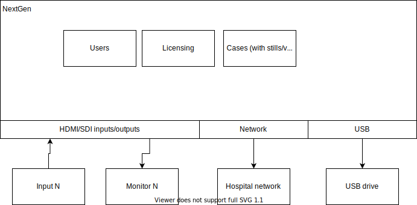

# Title

NextGen, a recording device and video router.

# Domain Description

Nurses operate camera equipment and video recorders for the surgeons. The device the nurse uses is NextGen.

NextGen routes cameras to different monitors in the room. It also records input feeds to jpg/mp4 for later archiving to USB drivers, or uploaded to the hospital network.

# Company Objective

Provide a product that makes the surgeory recording process simple and reliable for nurses in the operating room. Provide an API for larger OEMs that want a deeper integration into their existing ecosystem. The API will serve as motivation for OEMs to integration with our APIs on other products, given that the API used across them is generally the same, with only a few differences.

# System Vision

To be usable out-of-the-box, but also provide an API for deeper integrations into existing OEMs with custom needs and workflows.

# System Description

* A GUI that sits on top of an API.
* An API with authentication and authorization.
* An API with licensing to unlock features.
  * Only X number of inputs/outputs can be used, unless license is applied (via API or GUI).
  * Only X number of users, unless a license is applied (via API or GUI).

Competitors provide an eco-system and user interface, we want to also provide a clean API eco-system that encourages vendor lockin.

The modules will be re-used across multiple hardware variants. Some devices will lack recording, and will just route video (like a monitor).

# System Context Diagram

Add a system context diagram for your system (i.e. your system as a black box in the middle surrounded by external actors, systems and events interacting with the system)

# Main Use Cases

Describe or draw (e.g. as a BPMN diagram) the main uses cases from the business point of view, as they would be described by a business person. Don’t try to distil any core use cases as we would do as part of the Method.

* As a user or API, I want to route video from one input to an output.
* As a user or API, I want to record video and send it to a USB drive.

# Additional Information

Add any additional information that would be helpful to get a better understanding of the system to be built